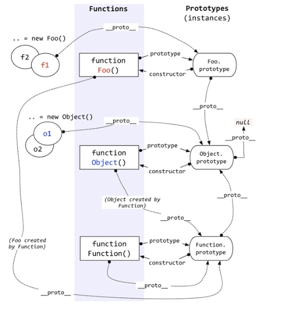

# HTML5 

## 全局属性
> [参考网站](http://www.w3school.com.cn/tags/html_ref_canvas.asp)

- `querySelector()`选择器.

|属性|描述|
|accesskey|规定激活元素的快捷键。|
|class|规定元素的一个或多个类名（引用样式表中的类）。|
|contenteditable|规定元素内容是否可编辑。|
|contextmenu|规定元素的上下文菜单。上下文菜单在用户点击元素时显示。|
|data-*|用于存储页面或应用程序的私有定制数据。|
|dir|规定元素中内容的文本方向。|
|draggable|规定元素是否可拖动。|
|dropzone|规定在拖动被拖动数据时是否进行复制、移动或链接。|
|hidden|规定元素仍未或不再相关。|
|id|规定元素的唯一 id。|
|lang|规定元素内容的语言。|
|spellcheck|规定是否对元素进行拼写和语法检查。|
|style|规定元素的行内 CSS 样式。|
|tabindex|规定元素的 tab 键次序。|
|title|规定有关元素的额外信息。|
|translate|规定是否应该翻译元素内容。|

## 网页结构化,如

* 声明:`<!DOCTYPE html>` 比如html4`<>`
* 字符集:`<mate charset="utf-8">` 比如html4`<>`
* 导航:`<nav></nav>`,可应用于传统导航,左导航等.
* 与上下门不相关的内容区域名`<article></article>`

```
<article>
	<header>
		<h1>Artcile是独立区域,下面可以再有header</h1>
	</header>
	<section>
		<h3>读者评论.</h3>
		<p><time pubdata datatime="2017-09-28" putdata="pubdata" >2017-11-55</time></p>
	<section>
	<footer>
		<p><small>底部信息...</small></p>
	</footer>
</article>
```

* 附属信息标签`aside`
* 内容元素`<section></section>`
* 发布时间,pubdata`<time pubdata datatime="2017-09-28" putdata="pubdata" >`
* 分组标题和子标题`<hgroup></hgroup>`
* 上层内容区块注脚,或网页注脚`<footer></footer>`
* 联系信息标签`<address></address>`
* 元素组合,表示一块独立区域 `<figure></figure>`,配合`<figcaption></figcaption>`

```
<figure>
	
	<figcatipn>title</figcaption>
</figure>
```

* `<detials>`展开收缩标签,`<summary>`属于detail元素.

```
<details>
	<summary>
	详细信息.
	</summary>
	<p>
	点击打开信息
	</p>
</details>
```

* 高亮显示元素`<mark></mark>`
* 进度条元素`<progress max="100" value="80" ><progress>`
* 规定范围,图形化显示使用值`<meter value="43.9" max="5000" low="20" higt="70" optimum="43" min="0"></meter>`

- 废除的元素`<basefont>`,`<bit>`(加粗),`<center>`,`<font>`,`<s>`,`<trike>`,,`<tt>`,`<u>`,`<frame>`(改为只支持iframe)`<frameset>,<noframes>`,`<bgsound>`,`<blink>`,`<marquee>`
- 变更的元素`<applet>`改为由`<embed>,<object>`代替. `<bgsound>`由`<audio>`代替.`<marquee>`由javascript来代替.
- 其他废除元素`<rb>`=>`<>`

- `<ol></ol>`元素.对列进行编号,`START`开始编号,`TYPE`编号类型,`reversed`是否反转

```
    <ol START="1" TYPE="1" reversed="reversed">
        <li><a href="">有序列表</a></li>
        <li><a href="">有序列表</a></li>
        <li><a href="">有序列表</a></li>
        <li><a href="">有序列表</a></li>
    </ol>
```

- 重新定义过的`<dl>`.dl是用来定义术于解释.`<dt></dt>`解释项.`<dd></dd>`解释详情

```
    <dl START="1" TYPE="1" reversed="reversed">
        <dt>HTML5</dt>
        <dd>HTML5是最新版本的HTML标记语言.</dd>
        <dt>css3</dt>
        <dd>css3是最新定义的样式表.</dd>
    </dl>
```

- `<convas>`
> 使用javascript的`draw("canvas_id")`来绘图,两种方法绘制,填充`fill`,边框`stroke`.  
使用`fillStyle`和`strokeStyle`给背景和边框  
`lineWidth`边框,描边的粗细.  
`rgba(红,绿,蓝,透明度)`相比`rgb(红,绿,蓝)`多一个参数透明度.如`rgba(255,0,0,0.25)`

- `canvas`绘制圆形.
> 1.创建开始路径  
2.创建图形路径(x起点横坐标,y起点的纵坐标,radius半径,starAngle是开始的角度,endAngle结束的角度,是否顺时针)  
3.创建完成的关闭路径  
4.设置绘制样式  
5.如果没有开始路径`beginPath()`和结束`closePath()`会把所有图绘制成一张.

```
    var canvas = document.getElementById("canvas");
    var context = canvas.getContext("2d");//取得上下文
    context.fillStyle="#eee";//背景颜色
    context.strokeStyle="red";//边框颜色
    context.lineWidth = 1;//画笔宽度
    context.fillRect(0,0,400,400);//x座标,y座标,宽,高
    context.strokeRect(50,50,180,180);//x座标,y座标,宽,高
    //画圆形
    /*
    1. 创建开始路径
    2. 创建图形路径(x起点横坐标,y起点的纵坐标,radius半径,starAngle是开始的角度,end)
    3. 创建完成的关闭路径
    4. 设置绘制样式
    */
    for(var i=0;i<10;i++){
        context.beginPath();//开始路径
        context.arc(i*25,i*25,i*10,0,Math.PI*2,true);//图形路径 x起点横坐标,y起点的纵坐标,radius半径,starAngle是开始的角度,endAngle结束的角度,是否顺时针
        context.closePath();//关闭该圆
        context.fillStyle = "rgba(255,0,0,0.25)";
        context.strokeStyle = "#000";
        context.fill();//开始绘制.
    }

```

- `canvas`绘制文字
> `fillText(text,x,y,[maxwidth])` 文字,X坐标,Y坐标,最多显示的宽度,如果超宽会被压缩.  `strokeStyle()`设置镂空文字的边框样式.
```
    context.textBaseline = "top";//默认垂直对齐会隐藏一半文字
    context.fillStyle = "green";
    context.font = "bold 30px 'Microsoft YaHei'";//设置字体
    context.fillText("使用Canvas画的文字",50,50);//文字,X坐标,Y坐标,最多显示的宽度,如果超宽会被压缩.  
    context.strokeStyle = "purple";
    context.font = "bold 40px 'Microsoft YaHei'";
    context.strokeText("使用填充过的字体",50,100);
    context.fill();//开始绘制
```

- `canvas`base64文件的保存.
> data URL.是一个64位编码的URL.格式`data:image/jpeg;base64`
```
    var fullQuality = canvas.toDataURL("image/jpeg",1.0);//图片格式,图片质量
    document.write(fullQuality)
```

- `canvas`动画,使用`setTimeOut()`可以编制canvas动画.
- H5,WebStorage本地存储技术,永久存储:`localStorage`.临时存储`sessionStorge`.
> 存放数据`sessionStorage.saveItem(key,value)`,获取数据`localStorage.getItem(key)`
```
    function saveStorage(e){
        sessionStorage.setItem("message",e.value)
    }
    function getStorage(){
        var message = sessionStorage.getItem("message")
        console.log(message)
    }
```

- `<audio>`音频控件
- `<video>`视频控件
> `controls`默认使用浏览器的播放控件.`source`用来指定格式,浏览器将由上而下选择自己支持的格式为止
```
<video controls="controls">
	<source src="mp4.mp4" type="video/mp4" />
	<source src="xxx.xxx" type="video/xxx" />
</video>
```

# CSS3

- 属性选择器新增3个正则
> `[att*=val]`表示属性值中包含val指定的字符.如`[id*=xxx],[class*=xxx]`  
`[att^=val]`表示属性开始包含  
`[att$=val]`表示结尾包含

- 伪类选择器`:after`,`:before`,`:link`,`:hover`,`:active`,`:visited`
- 伪元素`first-line`=>第一行文字定义样式,`first-letter`=>对文字首字母选择,`before`=>在元素之前插入内容,`after`在元素之后插入内容.
- 结构性选择器
> `first-child`单元指定第一个元素的样式.  
`last-child`倒数第一个.

- `selection`用来指定当文字被选中最的背景颜色.
- 兄弟元素选择器`~`,如`div~span{font-color:red}`
- 使用选择器向元素插入内容`.span{content:"sss"}`,使用`content`可以插入内容,可以插入图片内容`.span{content:url(glod.gif);}`
- 选择器添加计数器`content:counter(xxx)`,xxx是指定的计数器名称.
- 文字阴影`text-shadow`,参数`1.阴影离开文字的横坐标的距离,2,阴影离开纵坐标的距离,3,阴影模糊程度,4,颜色.`
```
	/*使用多个阴影*/
	h1:first-child{
        text-shadow: 15px 15px 3px #000,30px 30px 3px green;
    }
	h1:last-child{
        text-shadow: 15px 15px 3px #000;
    }
```

- 使用服务端字体,这样网页会使用服务端字体.
```
@font-face{
	font-family:xxx;
	src:url(xxx.otf);
}
```

+ 盒模型`display`.分为两类`block`和`inline`
> `inline-block`是css2.1新加的效果.具有和`inline`的特性.  
`inline-block`特性是内容会溢出.而`inline`不会溢出.  
`inline-block`是用来显示`css`多个并列元素的盒模型.  
`inline-block`将直接使两个`div`并列显示,而不需要`float:left;`  
`vertical-align:top`将使元素顶部对齐.因为元素的默认对齐方式是底部对齐.  
`inline-table`将使表格和文字在同一行显示  
`inline-list`给予列表属性  

+ 表格盒模型
> `display:table`,`display:table-catipn`,`display:table-header-group`,`display:table-row`,`display:table-cell`

- 背景图自动伸缩控制
> `-webkit-border-image: url("symbg.jpg") 0/0px stretch stretch` 参数说明:1,边框图像路径,2.上边距,3.下边距,4左边距/border宽度 topbottom leftright.  
topbottom leftright 有3个设置项.`repeat`平铺显示,`stretch`拉伸显示,`round`平铺但如果最后一次平铺不能完全显示时就不显示.

```
        body{
            -webkit-border-image: url("symbg.jpg") 0/0px stretch stretch;
		
        }
		html,body{
			height:100%;
			padding:0;
			margin:0;
		}
```

- css3变形`transform`
> 旋转`rotate`,专用旋转单位`deg`,代码示例`transform:rotate(45deg);`  
缩放`scale(x,y)`,x,y轴上的缩放比例. 代码示例`-webkit-transform:scale(0.5,0.5)`  
旋转`skew(10deg,10deg)`,x,y轴上同时扭典,如果只有一个参数则只有`x轴`上扭曲.同时还有`skewx`,`skewy`两项  
移动`translate(x,y)`,在x,y轴上移动.如果只有一个参数由只在`x轴`移动.  
改变基点,将影响旋转的中心轴.`transform-origin:bottom right`.总共有9个点.  
**同时使用多种效果**:`transform:translate(50px,50px) rotate(50deg);`

* css3动画
- `transition`.
- `animations`.

+ 多栏布局`column-count`
> `display:-webkit-box;` 

- 弹性盒布局
> `box-flex`

# ECMA 6规范
- `use strict`JS的严格模式,检查语法
- 定义一个作用域块
```
{
	"use strict"
	let a = 123;
}
```

- const 限制的是给值赋值的动作.但不限制该恒量里的值
```
const arr = ["bird"]
att.push("wolf")
```

- 解构一个数组
```
let a = ["bird","aolf"];
let {bird,aolf} = a;
console.log(bird)
```

- 解构一个对象
```
//将对象中的cat解析到newcat中
let obj = {
	cat :"tom",
	bird:"eagle"
}
let {cat:newcat} = obj
console.log(netcat)
```

- 字符模块
```
let string_template = `这是被解构后的对象植${newcat}`
```

- 字符模板
```
let m = tag`这是带标签的模版字符串.${newcat}`;
function tag(string_template,...v)
{
	console.log(string_template)//输入字符的数组,不含${xxx}
	console.log(v)//输入${xx}的数组
}
```

- 判断字符串
```
let s = "动点世纪"
s.starsWith("动")//true
s.endsWith("纪")//true
s.includes("点")//true
```

- 函数默认值
```
function N(n=10){
	console.log(n)
}
```

- 展开数组
> ...剩余操作符
```
let a = [1,2,3]
console.log(...a)//opt 1,2,3
let b = [0,...a]
console.log(b)
```

- set方法
> add 添加
> values 读取
> kes 列出
> size 大小
> has 是否包含
> delete 删除
> forEach 循环
> clear 清除
```
var set = new Set({
	a:"a",
	b:"b"
});
set.forEach(v => {
  console.log(v)
})
```

- Map
> 是一组键值对的结构，具有极快的查找速度。
> set
> get
> delete
> clear
> forEach
> size
> keys

- 箭头函数
```
var f = (...v)=>{
	console.log(v)
}
```

- 对象表达式
```
let smart = "smart",allow = "allow";
var theObject = {
  smart,
  allow
}
```

- Object新方法
> Object.is(obj1,obj2);对比对象
> Object.create();创建一个对象,

```
var o = Object.create({x:1});//传入的对象将作为o的原型__proto__
var o4 = Object.create(null);  //还可以通过传入参数null来创建一个没有原型的新对象，这个功能是前两种方法所不具备的。
//create(o,{})  第二个参数是原型增强.
```

> Object.setPrototypeOf() ;设置对象的原型.
> Object.getPrototypeOf() ;取得对象的原型.

- 迭代器

```
//旧代码
function chef(foods)
{
  let i = 0;
  return {
    next(){
      let done = ( i>= foods.length );
      let value = !done ? foods[i++] : undefined;
      return {
        value:value,
        done:done
      }
    }
  }
}
let wa = chef(["aaa","bbb"]);
console.log(wa.next());
console.log(wa.next());
console.log(wa.next());
console.log(wa.next());
```

- function* 加*号会定义一个生成器函数

```
function* cheGenerators()
{
  yield "bird";
  yield "fish";
}
let lterator = cheGenerators()
//使用生成器函数可以直接迭代.
//生成器函数不能当构造器使用
console.log(lterator.next());
console.log(lterator.next());
```

- JS 的类
> constructor(){} 构造方法
> static 静态方法,不需要new可以直接使用

```
class IsJS{
  constructor( food){ //构造方法
    this.food = food;
  }
  get g(){
    return this.food;
  }

  set g(food){
    this.food.push (food);
  }
  cook(){
    console.log(this.hood)
  }
  static console_()//静态方法,可以未经声明直接引用
  {
    console.log('-------------------')
  }
}

let jsClass = new IsJS(["bird","fish","dog"]);
IsJS.console_();//直接 调用静态方法
let g = jsClass.g
console.log(g)
jsClass.g = "snake"
console.log(g)
```

- 类的继承
> extends 关键字
```
class Person{
  constructor(name,birthday){
    this.name = name;
    this.birthday = birthday;
  }
  intro(){
    console.log(this.name);
    console.log(this.birthday);
  }
}


class chidren extends Person{
  constructor(n,b){
    //super 即父级.
    super(n,b);
  }
}

let tom = new chidren("tom","1988-9-9");
tom.intro();
```
- JS模型
> import * as model from "./modules"; 导入模块
> 导出模块
```
let s = {
  a : "a",
  b : "b"
}
function generator(){}
export {s,generator as gener};
```
> 导出默认模块
```
let s = {
  a : "a",
  b : "b"
}
export default s;
```

# react

## 使用jspm管理
```
npm install jspm
jspm install react
jspm install semantic-ui
```

## 使用bable
```
npm install bable-cli -g //6.0以上版本的安装方法

npm install bable-preset-es2015 --save-dev
npm install bable-preset-es2015-loose --save-dev 
npm install bable-preset-es2016 --save-dev

touch .babelrc
echo {"presets":["es2015","es2016"]} >.babelrc

vim package.json
```

## scripts
```
"build":"babel src -d dist"
	or
"build":"babel src -d dist -w"
```

## 使用 模块 插件 
```
npm install babel-plugin-add-module-exports --save-dev
vim .babelrc
```

## add 
`"plugins":["add-module-exports"]`

#可以使用模块暴露方法
## 代码转换
```
npm install babel-plugin-transform-es2015-modules-umd --save-dev
vim .babelrc
```

## add 
```
"plugins":["transform-es2015-modules-umd"]
```

## 使用react
```
npm install babel-preset-react --save-dev
```

## 使用gulp
```
npm install babel-gulp gulp --save-dev
```

## webpack打包
`npm insatll webpack --save-dev`

## 配置webpack.config.js
> 1.暴露config
> entry:入口文件
```
output:{
	path
	filename
}
module:{
    loaders:[
      
        {
          test: /\.js$/,
          loader:"babel",  
          exclude:/node_modules/
        }
    ]
  }
}
module.exports = config
```

## 配置 package.json
```
scripts
"build":"webpack --progress --colors"
```

## 使用 webpack 搭建 react
```
npm install webpack webpack-dev-server --save-dev
npm install babel-core babel-loader babel-preset-es2015 babel-preset-es2016 babel-preset-react --save-dev
npm install html-webpack-plugin --save-dev
```

# 面对对象编程
* lexicalEnvironment-词法环境
* scope-作用范围
* Closure-闭包

```
    #一个简单的闭包
	()(function(){
		var m = 0;
		function setM(n){
			m = n;
		}
		function getM(){
			alert(m);
		}
		window.getM = getM;
		window.setM = setM;
	});

    #用闭包代替this.index
	for(var i =0;i<3;i++){
		var ele = document.getElementById("ele"+i);
		ele = (function(id){
			return function(){
				alert(id)
			}
		})(i)
	}
```

- OPP  
```
var p = {
		name:"ddweb",
		_age:18,
		get age(){
			return this._age;
		},
		set age(n){
			if(n<0 || n>130){
				throw new Error("invalid value")
			}else{
				this._age = n;
			}
		}
	}
```

* 对象访问方式  
```
	Object.defineProperty(p,"yy",{
		value:1000,
		writable:false,//是否可写入
		enumerable:,//可枚举 enuerable
		configurable:,//可配置,如果是false则该属性不可以被删除
	})
```

* Object反射型循环  
```
for(var p in json){
	console.log(p)
}
```

* Object.keys(obt)循环  
* Object 是否存在某个属性   
```
	if(a in obj){
		console.log("对象存在")
	}
	//or
	if(obj.hasOwnProerty("name")){
		console.log("name存在")
	}
```

* 查看属性的特性  
```
var pPorperty = Object.getOwnPropertyDescriptor(p);
```

* 了解对象的差别, 构造器 constructor  
```
	//判断对象自变量 Object
	var o = {};
	var o1 = new Object();
	if(o.constructor === o1.constructor){
		console.log("一致!")
	}
```

* 判读对象类型  
> typeof a
> a instanceof Object

* 工厂函数 创建的对象将互相独立  

```
function PersonFactory(name,age)
{
	return {
		name:name,
		age:age
	};
}
```

* 类的基本  
```
	function Person() //对象首字母为大写
	{
		this.age = 30;
	}
	Person.prototype.HeadCount = 1;//共有属性使用原型.prototype
	var p = new Person();
```

* prototype   
> 只有函数才有prototype

* this  
> this只是在运行是决定指向谁.
> o.call(o,"name");//改变this指向

```
//自定义的New
function New(f)
{
	return function(f)
	{
		var o = {"__proto__":f.prototype}
		f.apply(o,arguments)
		return 
	}
}
var p2 = New(Persion)("cj",22);
``` 

> o.apply(o,["name"])  

* 封装  
-  命名空间  
> 使用对象来模拟  
```
	var namespace = {}
	namespace.module=function(){}
	namespace.module; //命令空间.模型
```

- 静态方法  
- 公有方法  
```
function Person()
{
	var age = 100;//私有变量
	function pm(){};//私有函数
	this.name = "json"; //共有变量
	this.test = function(){//共有方法
		pm.call(this);
	}
}
function Person(pname)
{
	function pm()
	{
		console.log(self.name)
	}
	var self = {//用self模拟本身属性
		name:pname,
		test:function(){
			pm();
		}
	}
}
```

- 继承 
> 使用属性拷贝来模拟
```
var person={
	name:"cj:
}
var programer = {

}
function extends(a,c)
{
	var c = c || {};
	for(var prop in p)
	{
		a[p] = c[p]
	}
}
```

- 原型链  

- 深拷贝,完全拷贝一个对象来模拟对象
- 链式操作的本质就是不停的返回`this`.

# 前端工程化
- 视频节点`F:\BaiduYunDownload\前端课程大全\0x23：前端工程化\`

## 前端工程化-bower

### bower参数.安装`bower install`,列出`bower list`,搜索远程包`bower search xxx`

## 前端工程化-ESLint
- `npm install eslint`
- 检查代码`eslint --env browser --global JQuery --rule "no-undef:2" --rule "no-unused-vars:2" xxx.js`
- 检查且修复`eslint * --fix`
- 参数说明:`env`指定环境.`rule`指定规则`no-undef`-未定义变量的报错级别.`no-unused`未使用变量的报错级别.错误等级`0或'off'：关闭规则。 1或'warn'：打开规则，并且作为一个警告（并不会导致检查不通过）。 2或'error'：打开规则，并且作为一个错误 (退出码为1，检查不通过)。`
- 配置文件`.eslintrc.js`.使用`module.exports={}`直接导出.

### Eslint-开发工具上的使用
- WebStorm
> Preferences -> Languages & Frameworks -> JavaScript -> Code Quality Tools -> Eslint -> Enable (勾选) -> Apply -> OK

- Atom
> 安装linter-eslint

- Sublime
> 安装SublimeLinter  
安装SublimeLinter-contrib-eslint

## 前端工程化-CSSLint
- 安装`npm install -g csslint`
- 检查`csslint style.css`

## 前端工程化-HTMLHint
- 安装`npm install -g htmlhint`
- 检查`htmlhint index.html`
- 使用配置文件检查`htmlhint --config htmlhint.conf test.html`
- 批量检查`htmlhint www/**/*.{htm,html}`
- 检查参数`--rules`,示例.` htmlhint --rules tag-pair,id-class-value=underline test.html`
- 规则配置`.htmlhintrc`,添加如` "alt-require": true,`,所有规则参考<https://github.com/yaniswang/HTMLHint/wiki/Rules>
- 其他规则检查工具`html-tiy`

## 前端工程化mocha[js]/chai[js]
- 安装`npm install --global mocha`.chai安装`npm install chai -g`

## 前端工程化casperjs-自动化测试
- casperjs安装`npm install casperjs -g` 需要`phantomjs`的支持.
- phantomjs安装`npm install phantomjs -g`
- 示例代码
```
// 创建 casper 实例
var casper = require('casper').create({
    verbose: true,
    logLevel: 'info',
    onError: function(self, msg) {
        this.capture('error.png');
        console.log('error: ' + msg);
        self.exit();
    },
    pageSettings: {
        loadImages: false, // 不加载图片，为了速度更快
        loadPlugins: false
    },
    verbose: true
    // clientScript: ['jquery.js']
});
phantom.outputEncoding = "utf-8"; //解决中文乱码

/* 打开首页 */
casper.start('https://web.yd.sdy.ppmoney.com/', function() {
    this.echo(this.getTitle());
    this.echo(this.getCurrentUrl());
});
/* 点击登录按钮，去到登录页 */
casper.then(function() {
    this.click('a[title="登录"]');
    this.waitForSelector('form[action="/login/"]');
});

/* 输入登录表单 */
casper.then(function() {
    this.fill('form[action="/login/"]', {
        Phone: '15710376688',
        Password: '12345678'
    }, true);
});
/* 提交表单，登录 */
casper.then(function() {
    this.click('button[id="sendLogin"]');
});

casper.wait(3000); //等待三秒，预防未登录。

/* 充值 */
casper.then(function() {
    this.echo(this.getTitle());
    this.clickLabel('充值', 'a');

    console.log(1234);

    this.waitForSelector('input[id="monetary"]');
});

/* 设置充值金额 */
casper.then(function(){
    this.echo(this.getTitle());

    this.evaluate(function() {
        document.getElementById("monetary").value = 100;
        $("#btnRecharge").attr("class", "pp-btn pp-btn-lg btn-recharge");
    });

    this.wait(2000, function() {
        this.click('input[id="btnRecharge"]');
    });
    
    this.capture('recharge.png');
    this.waitForSelector('input[id="password"]');
});

/* 设置购买金额 */
casper.then(function() {
    this.echo(this.getTitle());

    this.evaluate(function() {
        document.getElementById("password").value = "12345678";
    });

    this.echo("充值金额： 1000元.");
});

casper.then(function() {
    this.click('input[id="nextButton"]');
    this.wait(10000, function() {
        this.capture("recharge.png");
    });
});

casper.on('remote.message', function(msg) {
    this.log(msg, 'info');
});

casper.run(function(){
    this.echo('测试运行完成...', 'INFO').exit();
});
```

## 前端工程化karam-自动化测试
- 可以配合`Jasmine`,参考<http://www.haomou.net/2015/03/10/2015_karma_jasmine/>
- 安装 `npm install karma -g`
- 安装 `npm install karma-mocha karma-sinon-chai karma-chrome-launcher -g`
- 安装 `npm install chai mocha sinon sinon-chai -g`
- 初始化`karma init`
- 更多参考<https://www.douban.com/note/334051223/>

## 前端工程化JsTestDriver-自动化测试 

## 前端工程化Zombie.js -自动化测试 

## 前端工程化GitHooks强制代码检查
- 安装`git clone https://github.com/wangshijun/githooks_old.git`

## 前端工程化Grunt -自动化
- web:`https://gruntjs.com/`,cn:`http://www.gruntjs.net/`
- 安装`npm install grunt-cli -g`.同时本地`./`文件夹下面也需要grunt`npm install --save-dev grunt `
- 执行`grunt xxx`
- 插件<https://gruntjs.com/plugins>
- 使用`matchdep`简化加载`require("matchdep").filterDev("grunt-*").forEach(grunt.loadNpmTasks)`
- 使用`load-grunt-tasks`简化加载`require("load-grunt-tasks")(grunt);`
- 使用:在根目录创建`Gruntfile.js`文件.
- 基本`Gruntfile.js`示例代码.
```
    var grunt = require("grunt");
    module.exports = function(grunt){
    	grunt.iniConfig({
    		pkg:grunt.file.readJSON("package.json")
    	});
    	//matchdep 简化加载 
    	require("matchdep").filterDev("grunt-*").forEach(grunt.loadNpmTasks);
    	//load-grunt-tasks
    	//require("load-grunt-tasks")(grunt);
    	
    	grunt.loadNpmTasks("grunt-file-regex-rename");
    
    	grunt.registerTask("default",[
    		//.......	
    	]);
    }
```

## 前端工程化gulp-工作流自动化.
- web:`https://gulpjs.com/`,github:`https://github.com/gulpjs/gulp/blob/v3.9.1/docs/getting-started.md`
- 安装`npm install --global gulp-cli`,同时本地项目添加`npm install --save-dev gulp`
- 使用:创建`gulpfile.js`在本地项目根目录下.
- 使用插件`npm install gulp-print --save-dev`,同时在项目中`require("gulp-print")`
- 自动化加载`gulp`.`gulp-autoload`
- 基本示例代码 `gulpfile.js`
```
    #plugin 
    require("gulp-print");
    var gulp = require('gulp');
    gulp.task('default', function() {
      // place code for your default task here
    });
    #任务组合
    gulp.task('default', ["xxxa","xxxb"]);
```

## 前端工程化 LiveReload-融入开发工作流.
- 安装`npm install -g livereload`
- 使用:执行`livereload`开始监听`35729`端口,在页面中插入如下代码.
```
    <script>
      document.write('<script src="http://' + (location.host || 'localhost').split(':')[0] +
      ':35729/livereload.js?snipver=1"></' + 'script>')
    </script> 
```

### gulp配合livereload
- 安装`npm install --save-dev gulp-load`

## 前端工程化 BrowserSync-多浏览器同时自动同步.
- 安装`npm install -g browser-sync`
- 启动`browser-sync start --server --files "css/*.css"`,参数:`--files`为自动刷新选项.

### BrowserSync - watchify自动打包.
- 安装`npm install -g watchify`
- 使用`watchify main.js -o static/bundle.js`

## 前端工程化  - requirejs 规范
- bower安装 <http://requirejs.org/> 下载
- 入口文件`data-main="main.js"`.`<script data-main="main.js" src="require.js"></script>`
- 模块化.建立`xxx/modules`文件夹.建立`xxx/main.js`入口文件.

## 前端工程化- Browserify 将node.js原生js模块打包为javascript.
- 安装`npm install -g browserify`,安装`npm install uniq`
- 打包`browserify main.js -o bundle.js`

## 前端工程化-打包工具webpack 基础

- - -

## Less
1. 变量`@c:#000;`,以`@`方式来定义..使用变量`color:@c;`.less变量的另一种写法`@attr:witch;`使用`{@{attr}:180px;}`
2. 变量是延迟加载.无须预先定义.可以定义在结尾.以下使用是合法的`{color:@{var}};@var:#000;`,变量会被后定义的覆盖.

- Less学习进程
> F:\BaiduYunDownload\前端课程大全\0x24：LESS\LESS学习 (03).mp4

- web:<http://lesscss.org/>,cn:<http://lesscss.cn/>
- 安装 `npm install -g less`
- 编译`lessc styles.less styles.css `

1. 变量`@xxx`,定义一个变量`@colora:green;`.使用变量`@xxx`或`@{xxx}`
2. 混合写法`.xxFunc(@xx:1px){border:@xx solid #ff0000;}`.如果使用了`()`定义为一个函数形式,则在编译中会不输出到css文件中.
3. `&`选择器.会选择所有父元素.`a{ &:hover{ color:red;}}`.当`&`在后面时,会把当前元素提升为父元素来编译.如`div2{ & div1 &{ top:0;}}`.
4. 命名参数`.xxxFunc(@lien:2px;@c:#000){color:@lien;color:@c}`
5. 匹配模式`.border(l,@len:1px){ border-left:@len solid red; }`,使用`.border(l)`.将匹配`left`的函数
6. 使用返回值.`.a(@a,@b){@c:(@a+@b)+10;}`.使用`.b{ .a(10,20){ width:@c; } }`
7. 运算符`+`,`-`,`*`,`/`.可以运算像素`(100px - 100)`.颜色`(#ffff - 10)`.颜色会先转为rgb的16位255值再运算.
8. 命名空间`>`访问符.`.w{ .l{ color:#fff; }}`.访问属性` .c{ .w>.l; }`.也可以使用空格访问`.c{ .w .l;}`
9. 引用`@import "main.less"`.带参数的引用`@import (reference) "main.less"`.参数`reference`使用但不输出,`inline`原样输出,`less`任何文件都以less输出.`css`任何文件都以css输出.`multiple`允许引入多次相同文件
10. 函数使用关键字.`!important`.`.foo(@c:#fff){ color:@c;}`使用`.w{ .foo() !important;}`
11. 比较运算`when`.`.mimin(@a) when (ispixel(@a)){  background-color: black;  }` 使用*when*比校 `.mimin(@a) when (ispercentage(@a)){ background-color:red;}`
12. 循环,通过递归调用来模拟循环.
```
.loop(@counter) when (@counter > 0){
	.loop(@counter - 1);
	h@{counter} {
		font-size: @counter * 10px;
	}
}
.conten{
	.loop(6);
}
```

13. 合并属性.`+`以`,`进行合并.`+_`以`\s`空格进行合并.
```
.mainFunc(){
	box-shadow+: inset 0 0 10px #2b542c;
}
.MyMain{
	.mainFunc();
	box-shadow+: inset 0 0 10px red;
}
.mainBgFunc(){
	background+_: url("./bg.jpg");
}
.MainBg{
	.mainBgFunc();
	background+_: center center;
}
```

14. 基本函数:`color(red);`提取颜色值,`convert(20px,pt)`单位转换,`data-uri("a.jpg")`将图片转为Base64,`default()`默认函数.`unit(10px,pt)`单位移出转换函数
15. 基本函数:`escape()`转义字符串,`e()`或`~"xx"`css转义字符串,`calc(980px-100px)`浏览器运算,`%("%a %A %S %s",1px,solid,#FFFFF,";")`,`a`普通,`A`会转义,`S`只接受颜色字符并去掉引号,`s`不接受颜色
16. 操作函数:`replace("Microsoft xxx","xxx","YaHei")`替换,`length(@list)`集合长度,`extract(@list)`提取集合值,集合`@list:red,wihte,black;`
17. 数学函数:`ceil();`向上取整. `floor();`向下取值 `percentage();`浮点转百分比 . `round()`四舍五入. `sqrt()` 计算平方根 ` abs()`计算绝对值. `sin(1)` 正弦值
18. 颜色定义函数 rgb();将16色转为#ffffff十六进制. argb();安卓开发使用.
19. 颜色通道函数 `bue()`
20. 颜色运算
21. 颜色混合函数

- - -

# Sass
- web:`www.sass-lang.com`
- `sass`,`scss`.都是sass文件.
-  Compass-sass的工具库.

- Sass学习进程
> F:\BaiduYunDownload\前端课程大全\0x25：Sass\Sass学习 (02).mp4

### 嵌套&注释
```
//不会被编译到css中
/*会编译到css中.*/
.xxx{
    ul{
        xxx
    }
}
```

## TypeScript

* 安装`npm install typescipt -g`
* 编译`tsc xxx.ts`

## vue

### MVVM

- `Model View ViewModel`模型
- `vm`相当于MVVM模型里的View Model.

### 使用一个新的Vue实例

- `el`:指定的范围元素

```
new Vue({
	el:"#app",
	data:{
		name:"abcde"
	}
	})
```

#### 条件

- `v-if`判断数据,同时具体`v-show`的效果

#### 绑定数据

- 绑定数据`{{dataName}}`,该值将查找Vue.data里的值
- input数据绑定需要使用`v-bind:value="dataName"`,可简写为`:value="dataName"`
- html绑定数据:`v-text`绑定的数据是平文本格式,`v-html`绑定的数据是html格式,其中的HTML代码会被解析
- 双向定绑数据时使用:`v-model="dataName"`,双向绑定时当数据有改变则数据源也被传递修改

#### 绑定事件

1. 绑定一个点击事件,`v-on:click="funName"`,该事件对应函数在Vue实例的`methods`对象中存在
2. 简写格式`@click="funName"`
3. 绑定一个按键事件,可以直接指定按键:`@keydown.enter="funName"`
4. 自定义按键:vue@1.0 ->`Vue.directive('on').keyCodes.f2=113`,vue@2.x ->`Vue.config.keyCodes.f2=113`

#### 过滤器

1. 使用管道符`|`来使用过滤器.在 vue@2.0 以上是移除过滤器的
2. 自定义过滤器(支持 2.x): 在Vue实例中`filters`对象中加入方法.
3. 全局自定义过滤器`Vue.filter('filterName',function(){return '.....'})`
4. 一段过滤器示例代码`filterBy '搜索条件' in dataName.name`

#### 自定义事件

1. 定义`v-test`,则在元素中可以直接使用`v-test`,但需要定义此方法
2. vue@1.0 使用`Vue.directive('test',{bind:function(){ this.vm;this.el;this.expression}})` 
3. `this.vm`表示当前的范围元素对象,`this.el`表示当前绑定的元素对象,`this.expression`表示当前绑定的元素的名字值
4. vue@2.0 使用`Vue.elementDirective('text',{bind:function(){}})`

#### GooleChrome调试工具

1. 插件商城安装`Vue.js devtools`

#### 动画

1. vue@1.0 先绑定`transition="animateName"`.并定义css`animateName-transition{transition :all 0.4s ease;} animateName-enter,animateName-leave{}`
2. vue@2.0 使用标签`<transition></transition>`
3. 可以配合`Animate.css`更简单的制作动画
4. 动画相关需要查阅官方文档

#### 组件

1. 扩展全局组件`var login = Vue.extend({template:"<h1>title</h1>"})`,并绑定组件`Vue.component('login',login)`
2. vue@2.x 直接绑定组件 `Vue.component('login',{template:"<a>logtin</a>"})`
3. 通过模版标签绑定组件`<template id="tp1"></template>`,`Vue.component('login',{tmplate:"#tp1"})`
4. 也可以通过`<script type="x-template">`标签来绑定
5. 组件的数据和方法只能绑定在组件内部.具体为:`Vue.component('login',{template:"",data:function(){return {}},methods{}})`,组件的数据绑定只能是函数,并返回一个对象
6. 父元素向子元素传值: vue@1.0 需要用`props:["valueName"]`来接收值,并在组件中展示数据. vue@2.xx 可以直接使用值.
7. 子元素向父元素传值: `this.$emit('sendKey',"value content")`
8. 组件切换,使用标签`<component :is="isSHOW"></component>`,更改绑定的数据值为 **对应的组件名称** 即可.
9. 子组件:`Vue.component({template:"#id",components:{template:"childer_name"}})`

#### 生命周期

1. `created`.常用的加载后执行项.`new Vue({created:function(){console.log('ready')}})`
2. 其他方法查阅官方文档,如`init,ready`

#### 获取DOM

1. vue@1.0 获取普通DOM.需要在元素上先绑定 `v-el="domname"`. 获取:`this.$els.domname`. 获取组件绑定`v-ref="domname"`,获取:`this.$refs.domname`
1. vue@2.0 可以简化绑定`ref="domname"`.普通元素和组件皆可获取`this.$refs.domname`

#### 路由

1. 需要引入独立的路由文件`vue-router.js`,并实例化一个顶级类`var App = new Vue.extend({})`
2. vue@1.0 路由地址绑定在`<a>`标签上,使用`v-link="{path:'/login'}"`来定义
3. vue@1.0 实例路由`var router = new VueRouter()`,并声明路由规则`router.map({'logtin':{component:login,subRouters:{}}})`,`component`是指定的组件,在路由规则下使用该组件
4. vue@1.0 传参时使用该格式`register/:id`.
5. vue@1.0 启动路由`router.start(App)`
6. vue@1.0 路由跳转`router.redirect({'/':"/login"})`
7. vue@2.0 路由地址绑定在`<router-link to="/login">`标签下
8. vue@2.0 将直接传入路由规则.如下:

```
var router = new VueRouter({
		router:[
			{
				'path':'/',
				redirect:'/login/100'
			},
			{
				path:'/login/id',
				component:login,
				children:[
					{
						path:'admin',//子路由不能有'/'开头
						component:admin
					}
				]
			}
		]
	})
	//启动路由
	new Vue({
		el:"#app",
		router:router
		})
```

#### 数据监控watch

1. Vue的实例下的watch可以监控任何数据.先建立一个数据模块`v-model='name'`
2. 例子:`new Vue({watch:{name:function(newData,oldData){console.log(newData,oldData)}}})`
3. 监控路由:`new Vue({watch:{"$route":function(newRoute,oldRoute){console.log(newRoute,oldRoute)}}})`

##### Vue计算组件

1. Vue的实例computed可以用来计算
2. 例子:`new Vue({computed:{full:function(){return this.nameA+this.nameB}}})`

* * *

## TypeScript

    # declare module 
    # module
    # namespace
    # `/// <reference path="test2.ts" />`

## WebPack

    # 安装
        # `npm install webpack -g`
        # `npm install webpack-cli -g`
        # `npm install webpack --save-dev`
        # `npm install webpack-cli --save-dev`
        
    # bable
        
        # 安装`cnpm install babel-loader babel-core --save-dev`
        # 安装`cnpm install @babel-preset-env --save-dev`
            # 配置`rules:[ test:"/\.js$/", use:{ loader:"babel-loader",options{ persets:[ ["env":{ modules:false,targets:{ node:"9.9.0"} }] ] }} ]`
            
        # 编译TypeScript
            
            # `cnpm i typescript ts-loader awesome-typescript-loader --save-dev`
            # 配置·rules:[ test:"/\.tsx?$/", use:{ loader:"awesome-typescript-loader",options{ persets:{transpileOnly:true/*加快编译速度 */,configFile:"./tsconfig.json"/*指定特定的ts编译配置，为了区分脚本的ts配置*/} }} ]·
        # 
        
    # typeings
        
        # 安装`npm i -g typings`,`npm i typings --save-dev`
        # 安装`typings install lodash --save`
    
    # 打包CSS
        
        
        
# 学习进度

    * `https://www.imooc.com/video/13515`
    * `F:\video\javascript-nodejs\由浅入深全面学习 Webpack 3.0\3-6`
    * `F:\video\javascript-nodejs\前端课程大全\0x35：【合集】VueJS 2.0\D20170806：VueJS 2.0就业班【基础+项目】\Vue.js2.0 Day3【基础】\视频`
    * `F:\BaiduYunDownload\前端课程大全\0x02：HTML5 CSS3详解\HTML5和CSS3 (50).mp4`

