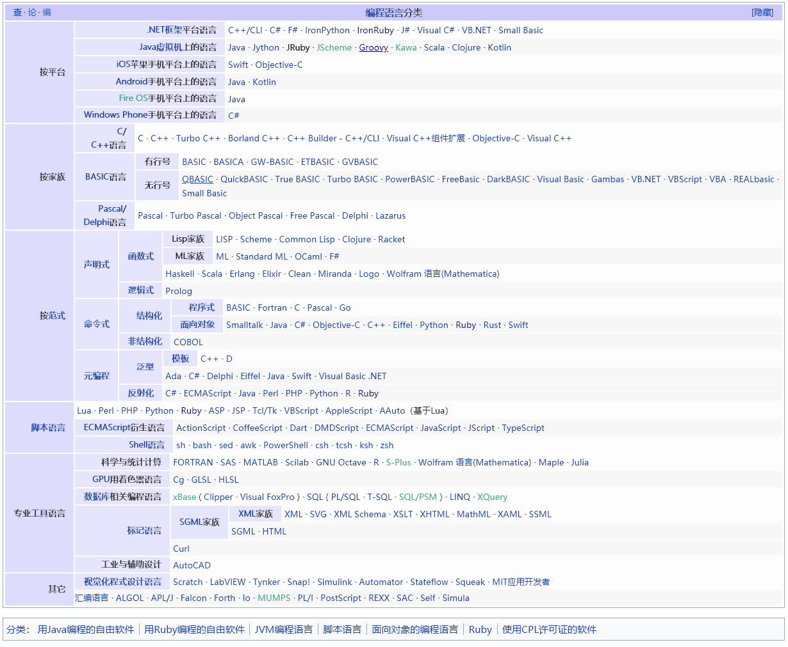

# 课程表
## 6小时学习时间
+ En-1小时
+ C-1小时
+ Java-1小时
+ C#-1小时
+ Python-1小时
+ JavaScript-1小时

## 5小时工作时间

## 扩展学习时间   
+ Ruby
+ Base-1小时

## markdown编写规范
- [markdown编写规范](https://www.appinn.com/markdown/)
## 编程平台

## IDE快捷键

|说明                                                |Webstorm              |Eclipse             |Sublime Text3       |Adoby Edge code     |VisualStudioCode    |Atom                |VisualStudio        |notepad++           |                    |                    |                    |                    |
| -:| - | - | - | - | - | - | - | - | - | - | - | - |
|   **查找/代替**                                    |                      |                    |                    |                    |                    |                    |                    |                    |                    |                    |                    |                    |
|通过文件名快速查找工程内的文件(必记)                |ctrl+shift+N          |ctrl+shift+R        |                    |                    |                    |                    |                    |                    |                    |                    |                    |                    |
|通过一个字符快速查找位置                            |ctrl+shift+alt+N      |ctrl+shift+alt+N    |                    |                    |                    |                    |                    |                    |                    |                    |                    |                    |
|在文件内快速查找代码                                |ctrl+F                |ctrl+F              |                    |                    |                    |                    |                    |                    |                    |                    |                    |                    |
|查找下一个                                          |F3                    |ctrl+K              |                    |                    |                    |                    |                    |                    |                    |                    |                    |                    |
|查找上一个                                          |shift+F3              |ctrl+shift+K        |                    |                    |                    |                    |                    |                    |                    |                    |                    |                    |
|文件内代码替换                                      |ctrl+R                |ctrl+F              |                    |                    |                    |                    |                    |                    |                    |                    |                    |                    |
|   **界面操作**                                     |                      |                    |                    |                    |                    |                    |                    |                    |                    |                    |                    |                    |
|快速查找并使用编辑器所有功能(必记)                  |ctrl+shift+A          |ctrl+shift+A        |                    |                    |                    |                    |                    |                    |                    |                    |                    |                    |
|快速拆合功能界面模块                                |alt+[0-9]             |alt+[0-9]           |                    |                    |                    |                    |                    |                    |                    |                    |                    |                    |
|最大区域显示代码(会隐藏其他的功能界面模块)          |ctrl+shift+F12        |ctrl+shift+F12      |                    |                    |                    |                    |                    |                    |                    |                    |                    |                    |
|将当前文件加入收藏夹                                |alt+shift+F           |alt+shift+F         |                    |                    |                    |                    |                    |                    |                    |                    |                    |                    |
|将当前文件加入收藏夹                                |ctrl+alt+s            |ctrl+alt+s          |                    |                    |                    |                    |                    |                    |                    |                    |                    |                    |
|切换代码选项卡(还要进行此选择,效率差些)             |ctrl+tab              |ctrl+tab            |                    |                    |                    |                    |                    |                    |                    |                    |                    |                    |
|切换代码选项卡                                      |alt+←/→               |alt+←/→             |                    |                    |                    |                    |                    |                    |                    |                    |                    |                    |
|打开Find/Replace 对话框                             |                      |                    |                    |                    |                    |                    |                    |Ctrl+H              |                    |                    |                    |                    |
|   **代码编辑**                                     |                      |                    |                    |                    |                    |                    |                    |                    |                    |                    |                    |                    |
|以单位左右移动                                      |                      |                    |Ctrl+← |Ctrl+→      |                    |                    |                    |Ctrl+左右箭头键     |                    |                    |                    |                    |                    |
|合并选中的多行代码为一行                            |                      |                    |Ctrl+J              |                    |                    |                    |                    |                    |                    |                    |                    |                    |
|复制当前行                                          |ctrl+D                |ctrl+Alt+↑          |ctrl+shift+d        |                    |                    |                    |Ctrl+D              |ctrl+D              |                    |                    |                    |                    |
|选中单词                                            |ctrl+W                |alt+shift+↑         |ctrl+d              |                    |                    |                    |Ctrl+单击           |                    |                    |                    |                    |                    |
|一次性选择全部的相同文本                            |                      |                    |                    |                    |                    |                    |                    |                    |                    |                    |                    |                    |
|以单词作为边界跳光标位置                            |ctrl+←/→              |ctrl+←/→            |                    |                    |                    |                    |                    |                    |                    |                    |                    |                    |
|新建一个文件或其他                                  |alt+insert            |alt+insert          |                    |                    |                    |                    |                    |                    |                    |                    |                    |                    |
|格式化代码                                          |ctrl+alt+L            |ctrl+alt+L          |                    |                    |                    |                    |                    |                    |                    |                    |                    |                    |    
|减少/扩大缩进(可以在代码中减少行缩进)               |shift+tab/tab         |shift+tab/tab       |                    |                    |                    |                    |                    |                    |                    |                    |                    |                    |
|删除一行                                            |ctrl+Y                |ctrl+D              |Ctrl+Shift+K        |                    |                    |                    |Ctrl+L              |Ctrl+L              |                    |                    |                    |                    |
|在代码下方插入一行                                  |shift+enter           |shift+enter         |Ctrl+Enter          |                    |                    |                    |                    |Ctrl+Alt+Enter      |                    |                    |                    |                    |
|在代码上方插入一行                                  |                      |                    |Ctrl+Shift+Enter    |                    |                    |                    |                    |Ctrl+Alt+Shift+Enter|                    |                    |                    |                    |
|当前行向上移动                                      |ctrl+shift+箭头       |alt+箭头            |ctrl+shift+箭头     |                    |                    |                    |alt+箭头            |Ctrl+Shift+箭头     |                    |                    |                    |                    |
|当前行向下移动                                      |ctrl+shift+箭头       |alt+箭头            |ctrl+shift+箭头     |                    |                    |                    |alt+箭头            |Ctrl-Shift-箭头     |                    |                    |                    |                    |
|删除光标之前的单词                                  |                      |                    |                    |                    |                    |                    |                    |Ctrl+BackSpace      |                    |                    |                    |                    |
|删除光标之后的单词                                  |                      |                    |Ctrl+K+K            |                    |                    |                    |                    |Ctrl+Delete         |                    |                    |                    |                    |
|删除光标到行首                                      |                      |                    |                    |                    |                    |                    |                    |Ctrl+Shift+BackSpace|                    |                    |                    |                    |
|删除光标到行尾                                      |                      |                    |                    |                    |                    |                    |CTRL+DELETE         |Ctrl+Shift+Delete   |                    |                    |                    |                    |
|合并多行                                            |                      |                    |                    |                    |                    |                    |                    |Ctrl+J              |                    |                    |                    |                    |
|上行行交换                                          |                      |                    |                    |                    |                    |                    |                    |Ctrl+T              |                    |                    |                    |                    |
|代码块注释                                          |ctrl+shift+/          |                    |Ctrl+Shift+/        |                    |                    |                    |Ctrl+Shift+L        |Ctrl-Shift-Q        |                    |                    |                    |                    |
|代码取消注释                                        |ctrl+shift+/          |                    |Ctrl+Shift+/        |                    |                    |                    |Ctrl+K,U            |Ctrl-Shift-Q        |                    |                    |                    |                    |
|   **光标**                                         |                      |                    |                    |                    |                    |                    |                    |                    |                    |                    |                    |                    |
|光标移动到行最前                                    |                      |                    |                    |                    |                    |                    |                    |Ctrl+F              |                    |                    |                    |                    |
|光标移动到行最后                                    |                      |                    |                    |                    |                    |                    |                    |Ctrl+B              |                    |                    |                    |                    |
|   **导航**                                         |                      |                    |                    |                    |                    |                    |                    |                    |                    |                    |                    |                    |
|进入代码编辑区域                                    |esc                   |esc                 |                    |                    |                    |                    |                    |                    |                    |                    |                    |                    |
|查找代码在其他界面模块的位置,颇为有用               |alt+F1                |alt+F1              |                    |                    |                    |                    |                    |                    |                    |                    |                    |                    |
|到指定行的代码                                      |ctrl+G                |ctrl+L              |                    |                    |                    |                    |                    |                    |                    |                    |                    |                    |
|光标到代码块的前面或后面                            |ctrl+]/[              |ctrl+]/[            |                    |                    |                    |                    |                    |                    |                    |                    |                    |                    |
|上一个/下一个方法                                   |alt+up/down           |ctrl+shift+up/down  |                    |                    |                    |                    |                    |                    |                    |                    |                    |                    |
|   **调试**                                         |                      |                    |                    |                    |                    |                    |                    |                    |                    |                    |                    |                    |
|Build运行                                           |                      |                    |                    |                    |                    |                    |F5                  |                    |                    |                    |                    |                    |

